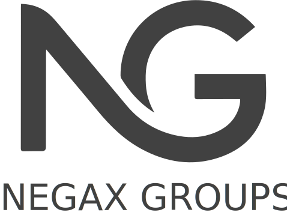

# Presupuesto — La Calita

_Una sola web (con área de hamburguesería). Precio cerrado, todo incluido._

---

## Desarrollo web completo — **1.390 € (pago único)**

Una web completa, moderna y **que gestionas tú mismo**, con todo lo siguiente incluido:

### 🌐 Web pública

- **Portada (inicio)** con carrusel de portadas: imagen o vídeo de fondo, logo, lema, frase de bienvenida y botones. Zona de eventos (botón, rótulo o agenda) y texto en movimiento opcional.
- **Cartas interactivas**: cada plato con foto o vídeo, precio (o "desde X €" con variantes), **alérgenos con iconos**, favoritos (♥), lista personal, **modo vídeo (reels)** de los platos, filtros por categoría y buscador.
- **Ficha de cada plato** y **agenda de eventos** (conciertos, DJ…) con su página de detalle.
- **Área Hamburguesería**: portada a pantalla completa con **efectos (humo, fuego, chispas, vídeo)**, anillos, **ofertas**, **las más votadas** y panel de alérgenos; carta en tema oscuro.
- **Registro e inicio de sesión de usuarios** y **valoraciones** de platos/hamburguesas (ranking de "**los más valorados**").
- **Diseño preparado para incorporar pagos de entradas y reservas** (listo para activar el cobro cuando se quiera).
- **Ubicación**: horarios, mapa y datos de contacto.

### 🛠️ Panel de administración (lo gestionas tú)

- Cambiar **textos, fotos, vídeos, precios, cartas, categorías, eventos y portadas** sin saber programar.
- **Editor de portada con previsualización en vivo** (ves cómo queda en PC y móvil antes de publicar).
- **Editor de la hamburguesería** (diapositivas y ofertas) con previsualización y efectos.
- Los cambios se ven **al instante** en la web.

### 🌍 Idiomas con Inteligencia Artificial

- Web en **3 idiomas: Español, Inglés y Francés**.
- Hemos **incorporado IA para traducir** los textos: con un botón, **"Generar traducciones"**, se rellenan inglés y francés a partir del español (luego puedes retocar a mano).
- **Posibilidad de añadir los idiomas que quieras** (alemán, italiano, etc.).

### 📱 Diseño y calidad

- **Se ve perfecto en PC, tablet y móvil** (diseño adaptable).
- Carga rápida, imágenes optimizadas, animaciones suaves.
- Certificado seguro (HTTPS) y preparada para Google (SEO básico).

### 🤝 Soporte incluido

- **Mantenimiento** y los **cambios e ideas** que se te vayan ocurriendo.
- **Ayuda para meter los platos** en las cartas y con las **traducciones**.
- **Formación**: una sesión para enseñarte a usar el panel.

> **Precio cerrado: 1.390 €** (pago único, todo lo anterior incluido).

---

## Servicios anuales (a precio de coste)

Servicios externos para que la web esté online (se pagan a sus proveedores, **sin recargo**):

| Servicio | Para qué | Coste aprox. |
|---|---|---|
| **Dominio** (`.es` / `.com`) | La dirección de la web | **~12–15 € / año** |
| **Base de datos y alojamiento** | Guarda cartas, fotos, eventos y traducciones; con copias de seguridad | **~23 €/mes ≈ 280 € / año** |
| **Total** | | **≈ 295 € / año** |

---

## Opcionales para más adelante (si te interesan)

- 🎟️ **Venta / reserva de entradas** para eventos (con pago y entrada con QR).
- 🍔 **Pedido y pago online** de hamburguesas.
- 🪑 Reserva de mesa · 📧 Newsletter · 🌐 Idioma adicional.

---

## Forma de pago

| Concepto | Importe |
|---|---|
| **Total del proyecto** | **1.390 €** |
| 1.º pago — al empezar (50 %) | **695 €** |
| 2.º pago — a la entrega (50 %) | **695 €** |

Pago por **transferencia bancaria**.
